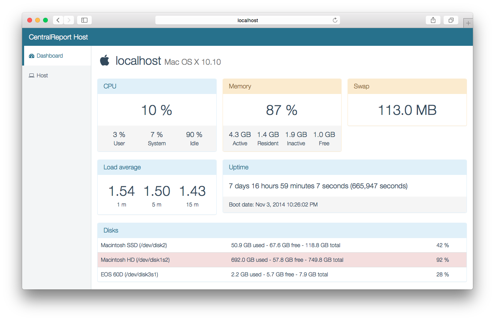
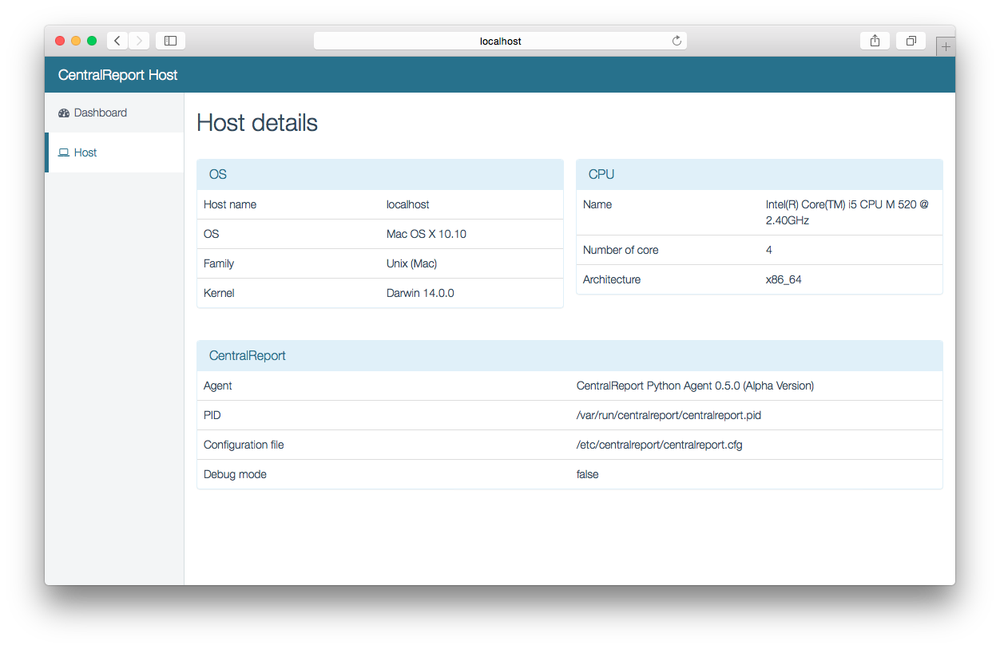

# CentralReport

**CentralReport is a lightweight tool for monitoring your computer or your server.**

Right now, CentralReport monitors:

* CPU
* Physical Memory (RAM)
* Virtual Memory (Swap)
* Load Average
* Uptime
* Disks

## The idea

We have many ideas to simplify server monitoring:

* A lightweight tool built in Python, helped by Bash scripts
* Very simple installation (one line in a terminal)
* Cross platform (**Debian, Ubuntu, CentOS and Mac OS X**)
* A simple web server
* A standard JSON API to retrieve host data and the lastest check

## Install or Uninstall CentralReport

Please visit the [Wiki installation page](http://docs.centralreport.net/unix-agent/install) to get the procedure depending on your system.

## Screeshots

Main dashboard page:

Host page:

## Documentation
You can find the documentation on [http://docs.centralreport.net/](http://docs.centralreport.net/).

## Get in touch
We are open to the world. If you want more information or if you are in a mood to collaborate, feel free to contact us.
We will gladly answer to every email
